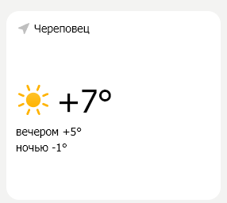
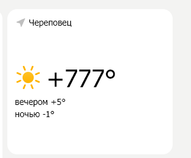

# На основе сайта [yandex.ru](www.yandex.ru).

* _Сайт работает на протоколе_ **<u>https</u>**:

* *Струтура сайта*

____

## Внесение изменений.
____

### 1.  *Погода*

* _До:_ 

* _После:_ 

____

### 2. *Клипы*

* _До:_

* _После_

____

### 3. *Виджеты*

* _До:_

* _После_

____

### 4. *Строка поиска*

* _До:_

* _После_

____

### 5. *Валюты*

* _До:_

* _После_

____

### 6. *Фон*

* _До:_

* _После_

____

### 7. *Цвет текста и иконок*

* _До:_

* _После_

____

### 8. *Выравнивание текста погоды*

* _До:_

* _После_

____

### 9. *Отступы по бокам, снизу и сверху*

* _До:_

* _После_

____

### 10. *Размер видео в блоке*

* _До:_

* _После_

____
## Прототип низкой детализации.

* *Примерный прототип*

